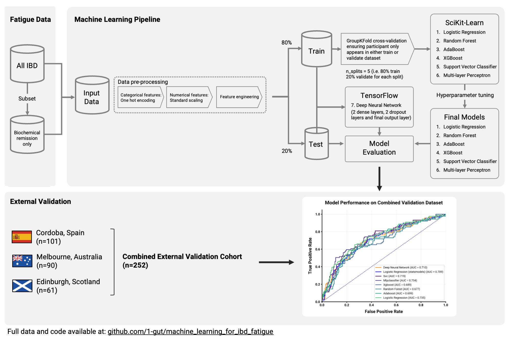

# Machine Learning for Fatigue in IBD

## Overview

This repository contains the data and code used to create the models referenced in the paper. The python notebooks are similar in process and differ in the input data being one with all the IBD patients and the other, only those in biochemical remission. Biochemical remission here defined as patient being asymptomatic + faecal calprotectin of <250 ug/g + C-reactive protein <5 mg/L.

## Pipeline Summary



## Requirements

- Python 3.11.9 [Install Here](https://www.python.org/downloads/)
- Git [Install Here](https://git-scm.com/downloads)

This repository has been tested with Python 3.11.9.

## Installation

### 1. Clone the repository

```bash
git clone https://github.com/1-gut/machine-learning-for-fatigue-in-ibd.git
```

### 2. Set up a Python virtual environment

```bash
cd machine-learning-for-fatigue-in-ibd
python -m venv venv
```

### 3. Activate the virtual environment

For MacOS/Linux:

```bash
source venv/bin/activate
```

For Windows:

```bash
.\venv\Scripts\activate
```

### 4. Install the required packages

```bash
pip install -r requirements.txt
```

## Usage

We recommend using VSCode to run the Jupyter notebooks. Choose the virtual environment you created in the previous step as the Python interpreter.

## Directory Structure

```sh
machine-learning-for-fatigue-in-ibd/
│
├── data/ # Anonymised data
├── working_data/ # Intermediate data following preprocessing with notebook 2
├── output/ # Notebook outputs here
├── 1_demographics.ipynb # Basic descriptive statistics for the cohorts
├── 2_ml_data_preprocessing.ipynb # Preprocessing steps
├── 3_all_ibd_ml_pipeline.ipynb # Main ML pipeline
├── 4_biochem_remission_ml_pipeline.ipynb # Same pipeline on biochemical remission cohort
```

## Citation

You are very welcomed to use the code within the notebooks as you wish. If you do use the data/models within, please cite the original paper here.

## Feedback

If you have any questions or feedback, please feel free to contact us at [shaun.chuah@glasgow.ac.uk](mailto:shaun.chuah@glasgow.ac.uk)

## Repository Authors

- Robert Whelan ([github.com/rw509](https://github.com/rw509))
- Shaun Chuah ([github.com/shaunchuah](https://github.com/shaunchuah))
